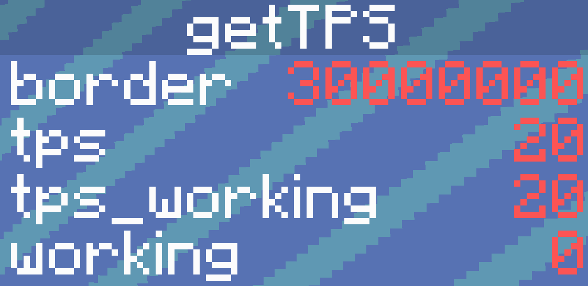

# GetTPS API
A simple API to add to your datapack.

**How to use:**

​	When needing to know the TPS, execute `/function tps:get_tps`

​	When finished, "working" in the scoreboard "getTPS" will be set to 0, and the result will be set to "tps"

​	

**Why to use?**

​	Extremely simple

​	Can be used to sync a speed of a timer to the real time.

​	Making animations / dialogs? They will no longer have to slow down when the server is laggy.

